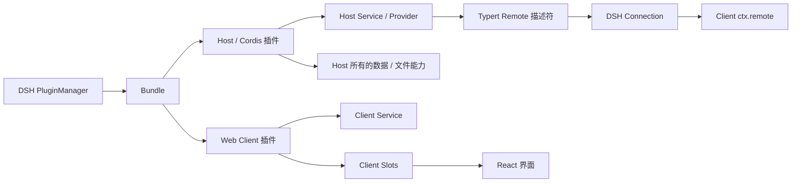

# 架构与边界

## 一个插件是什么

ElecKoi 插件是一个 **DSH bundle**。bundle 是安装和管理单位，可以同时包含：

- **Host 插件**：运行在 DSH Host/Cordis 环境，负责模型、Session、网络、文件和其他后台能力。
- **Web Client 插件**：运行在浏览器渲染环境，通过 Client Slots 和 Client service 扩展界面。
- **本地化资源**：插件中心标题、说明和插件自己的界面文案。
- **开发接口声明**：告诉插件中心本包提供或接入了哪些稳定合同。

插件中心管理 bundle；一个 bundle 内可以装配多个 Cordis 插件或界面组件。插件中心中的“运行组件”表示 bundle 实际装载的组件，“开发接口”表示其他插件能够使用的合同，两者不是同一概念。

## 运行层次

### Host

Host 可以使用其显式注入的 DSH 服务。需要操作 ElecKoi 产品数据时，必须使用已经公开的窄合同；第三方插件不能直接打开 ElecKoi SQLite，也不能导入 `apps/desktop/src/main` 内部模块。

### Web Client

Client 通过 `window.__ModuleLoader__.load` 注册，通过返回值中的 `inject` 声明 Cordis Client 依赖。它可以：

- 注册 UI Slot 组件；
- 调用公开 Client service；
- 使用 DSH Client 标准 hooks、store 和 locale；
- 通过正式 Remote/Host API 发起后台操作。

它不能直接访问 Electron、Node 或 SQLite。旧 `window.eleckoi` 业务桥已经删除。

## 五类开发接口

| 类型 | 用途 | 真实实现 |
| --- | --- | --- |
| `ui-slot` | 增加、包装或替换界面区域 | DSH `ctx.slots` |
| `service` | 在 Cordis Context 中调用状态或操作 | `ctx.provide` / `ctx.reflect.provide` |
| `event` | 订阅稳定事件 | Cordis event 或正式事件合同 |
| `remote` | 跨 Host/Client 调用 | DSH Remote 合同 |
| `contribution` | 向别的包拥有的注册点增加实现 | 对方公开的 register API |

当前公开目录已经包含 `ui-slot`、`service`、`contribution` 和由 Typert 生成的 `remote`。`event` 仅用于真实、稳定且可订阅的 Cordis/Connection 事件，不用于给内部广播改名。

## `provides` 与 `contributes`

- `provides`：本 bundle 是合同的所有者，负责合同定义、生命周期、类型和兼容性。
- `contributes`：本 bundle 只向其他包拥有的合同注册实现。例如 Tavily 插件向 `@deepseek-ai/dsh-web` 的搜索提供器注册表增加一个 provider。

一个插件使用某个服务或插槽，不需要把它再次声明成自己的开发接口。只有它**对外提供**合同或**向公共注册点贡献**实现时才写入 manifest。

## Slot 作用域

| 作用域 | 含义 |
| --- | --- |
| `root` | 整个 Client 根环境只有一份，不绑定聊天 Session |
| `session-maybe` | 可以随当前 Session 变化，也允许没有选中 Session |
| `session` | 必须绑定一个具体 DSH Session；切换 Session 时获得对应作用域 |
| `client` | Client Cordis Context 中的服务 |
| `host` | Host Cordis Context 中的服务或贡献 |

不要把 `session` 当成 React 页面生命周期。它是 DSH 的数据作用域，决定标准 hooks、store 和资源绑定到哪个 Session。

## 生命周期

1. PluginManager 解析 bundle manifest 并应用 `cordis.patch.yml`。
2. Host Loader 按依赖装配 Host 插件。
3. Client Loader 按 `dsh.client.inject` 装配 Web Client 插件。
4. Cordis effect、service、slot 和 provider 在插件作用域中注册。
5. 停用或卸载时，作用域释放；注册 disposer 必须撤销组件、provider、订阅和资源。

把注册放在 `ctx.effect`、`ctx.slots.inject` 或返回 disposer 的正式 API 中，可以让 Cordis 自动跟随插件生命周期清理。模块顶层的全局监听、计时器和缓存不会自动清理，应避免。

## 数据所有权

- 角色、角色设定、变量、正则、用户资料、预设和聊天记录由 ElecKoi 产品模块拥有；LLM 提供商、profile 与密钥由 DSH settings/profile/credentials 拥有。
- DSH Session 日志由 DSH Session 体系拥有。
- 插件自己的设置由插件或 DSH Settings/Storage 合同拥有。
- 插件停用或卸载不得删除产品数据，除非用户触发了明确的数据删除操作。

旧 Electron Desktop Gateway 已删除。跨 Host/Client 的产品能力只通过 [DSH Remote](remote.md) 或 DSH 已有的正式 Connection 数据协议开放；架构检查会阻止旧桥回流。

完整规则见 [生命周期、数据与安全](lifecycle-and-data.md)。
